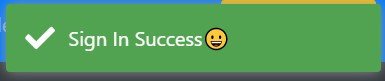
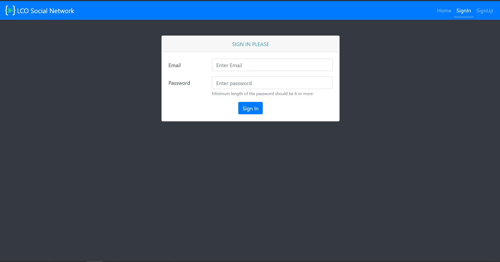
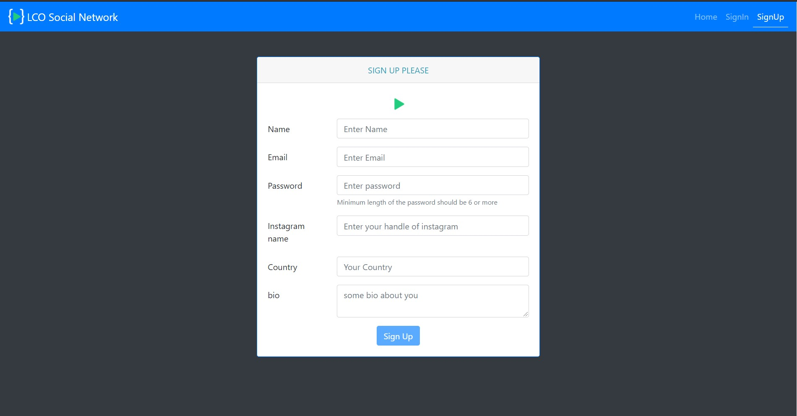
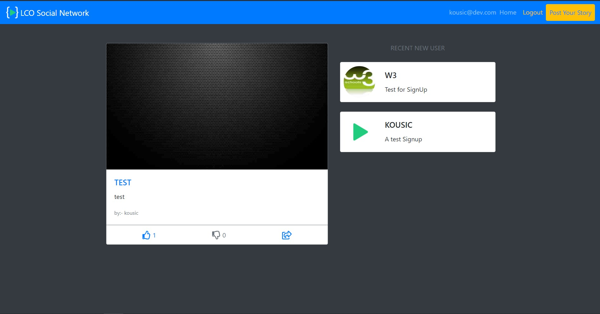
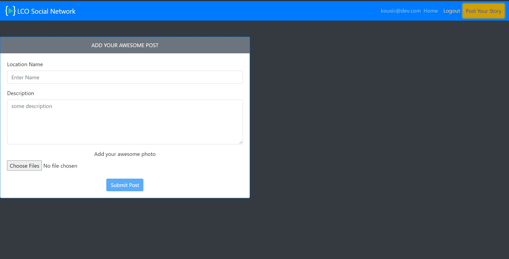
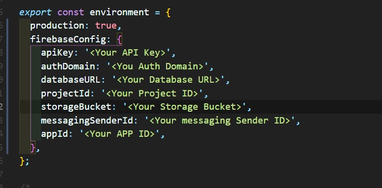

# Travelgram

## About

This a Instagram inspired App called Travelgram. This is a Full-Fledged social media app with **SignIn**, **SignUp**, **AddPost**, **Like and Dislike** a post.

## Topics Learned/Used

- Firebase (Authentication, Database, Storage)
- Angular Fire (@angular/fire), This is used for how to implement firebase in angular.
  For docs visit 👉 [AngularFire](https://github.com/angular/angularfire).

- Toastr , for sending toast messages to the user like this .
- FontAwesomeModule (@fortawesome/fontawesome), used for icons `like` and `dislike`.
- Bootstrap, for styling part.

## Images

- SignIn Page

- SignUp Page

- Home Page
  _ Here right-hand side rendering the list of users in db.
  _ Left-Hand side rendering the list of posts in db.

- AddPost Page

.

## Development server

This project was generated with [Angular CLI](https://github.com/angular/angular-cli) version 11.0.5.

Run `ng serve` for a dev server. Navigate to `http://localhost:4200/`. The app will automatically reload if you change any of the source files.

## Note

- After cloning the project into your machine, run `npm install` it will install all necessary dependencies into your project.

- Make sure you include your firebase credentials in `environment.ts` file in here

your firebase credentails are present in `login to firebase console` --> `go to settings` , scroll down you will see `cdn and config` options select **config**, now copy and paste the details in `environment.ts` as shown in above.

- To run your App enter the command mentioned in `Development server`.
